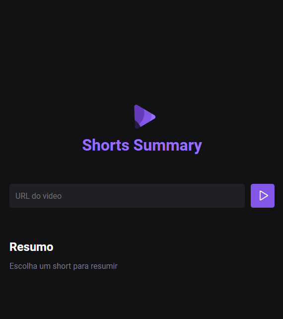

<h1 align="left"> Shorts Summary </h1>

NLW IA é um evento exclusivo e gratuito, promovido pela Rocketseat para ensino de tecnologias WEB.  

 

  

## 🚀 Tecnologias

Esse projeto foi desenvolvido com as seguintes tecnologias:

- HTML e CSS
- JavaScript
- Node.js
- Axios
- Inteligência Artificial
- Git e Github
- Figma

## 💻 Projeto

O shorts summary é um projeto que utiliza inteligência artificial para criar resumos de vídeos do YouTube Shorts.

[Acesse o Link do projeto]()

## 🔖 Layout

Você pode visualizar o layout do projeto através [DESSE LINK](https://www.figma.com/community/file/1282823495335498952/shorts-summary-trilha-foundations). É necessário ter conta no [Figma](https://figma.com) para acessá-lo.